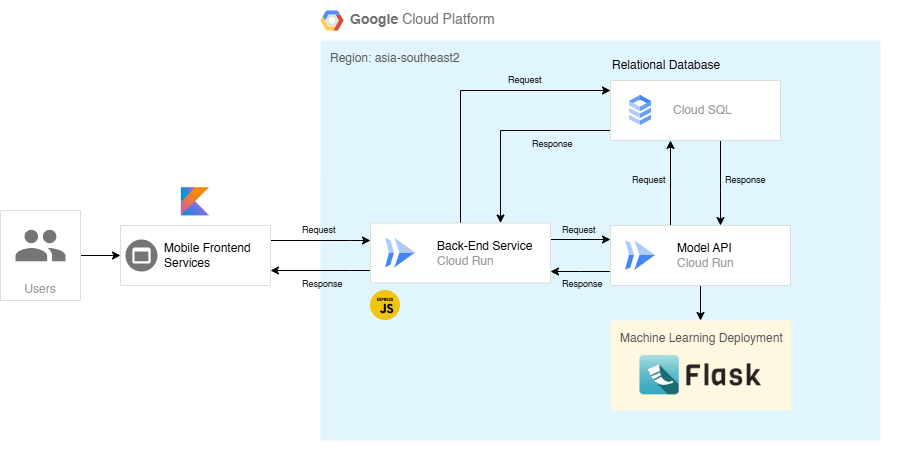

# Backend API Documentation 🧑‍💻

## How to run this API on your local machine 💻

If you want to run this API Server on your local machine, you need to do this steps:

Clone this repository. `git clone -b backend https://github.com/ferzanoveri/StuntGuard.git`

### Backend Service
1. Navigate to the directory using `cd StuntGuard-Backend`.
2. Install all required dependencies by typing `npm ci` or `npm i` in the terminal.
3. Remember to create your `.env` file according to your settings.
4. Ensure your XAMPP is running and create a database with the same name as specified in your `.env` file.
5. If needed, run `npx prisma generate` before migrating your databases with `npx prisma migrate dev`.
6. Start your application by running `npm run start-dev` in the terminal.

### Machine Learning
1. Navigate to the directory using `cd StuntGuard-ML`.
2. Install all necessary requirements by typing `pip install -r requirements.txt` in the terminal.
3. Make sure XAMPP is running and that you have a database set up as before.
4. Create your `.env` file with the required configurations.
5. Run your application using `python predict_service.py` in the terminal.

## StuntGuard API Endpoints

### Auth

| Endpoint             | Method | Input                                  | Description           | Status       |
|----------------------|--------|----------------------------------------|-----------------------|--------------|
| /register            | POST   | parent_name, email, phone, password, confirmPassword | Register account | ✅ Completed |
| /login               | POST   | email, password                        | Login to application  | ✅ Completed |

### Users

| Endpoint                 | Method | Input                                  | Description           | Status       |
|--------------------------|--------|----------------------------------------|-----------------------|--------------|
| /user/all                | GET    | -                                      | Get all parents data  | ✅ Completed |
| /user/id/:parent_id      | GET    | parent_id                              | Get parent data by ID | ✅ Completed |
| /user/update/:parent_id  | PUT   | parent_name, email, phone (optional)   | Update parent data    | ✅ Completed |
| /user/updatePassword/:parent_id | PUT   | oldPassword, newPassword, confirmPassword | Update parent password | ✅ Completed |
| /user/remove/:parent_id  | DELETE | -                                      | Remove parent account | ✅ Completed |

### Children

| Endpoint                        | Method | Input                                           | Description                   | Status       |
|---------------------------------|--------|-------------------------------------------------|-------------------------------|--------------|
| /child/:parent_id               | POST   | child_name, child_gender, birth_date, birth_weight, birth_height, breastfeeding | Add child data to family | ✅ Completed |
| /child/update/:child_id          | PUT   | child_name, child_gender, birth_date, birth_weight, birth_height, breastfeeding | Update child data          | ✅ Completed |
| /parent/childs/:parent_id       | GET    | need parent_id params                                       | Get children data by parent ID | ✅ Completed |
| /child/all                      | GET    | -                                               | Get all children data         | ✅ Completed |
| /child/id/:child_id             | GET    | need child_id params                                        | Get child data by ID          | ✅ Completed |
| /child/remove/:child_id         | DELETE | -                                               | Remove child data              | ✅ Completed |

### Predictions

| Endpoint                          | Method | Input                       | Description                   | Status       |
|-----------------------------------|--------|-----------------------------|-------------------------------|--------------|
| /predict/:child_id             | POST   | child_weight, child_height, breastfeeding(optional)  | Post a prediction             | ✅ Completed   |
| /predict/all                  | GET    | -                           | Get all predictions           | ✅ Completed   |
| /predict/id/:predict_id       | GET    | need predict_id params                 | Get predictions by predict_id | ✅ Completed   |
| /predict/child/:child_id   | GET    | need child_id params                   | Get predictions by child_id   | ✅ Completed   |

# Cloud Services

## 

## Deskripsi Layanan Cloud

1. **Cloud Run**
   - **Deskripsi:** Cloud Run digunakan sebagai backend service, selain itu juga untuk menyebarkan model machine learning dan endpoint API menggunakan layanan terkontainer.
   - **Fungsi:** Menyediakan lingkungan yang dapat diskalakan untuk aplikasi berbasis kontainer.

3. **Cloud Storage**
   - **Deskripsi:** Cloud Storage digunakan untuk menyimpan aset dan model machine learning.
   - **Fungsi:** Menyediakan penyimpanan yang tahan lama dan aman untuk data dalam jumlah besar.

4. **Cloud SQL**
   - **Deskripsi:** Cloud SQL digunakan untuk menyimpan data relasional berupa data pengguna, data anak, serta data hasil prediksi model ml.
   - **Fungsi:** Mengelola basis data relasional dengan MySQL.

6. **Postman**
   - **Deskripsi:** Postman digunakan untuk menguji API backend.
   - **Fungsi:** Menyediakan alat untuk mengembangkan, menguji, dan mendokumentasikan API.

## 
